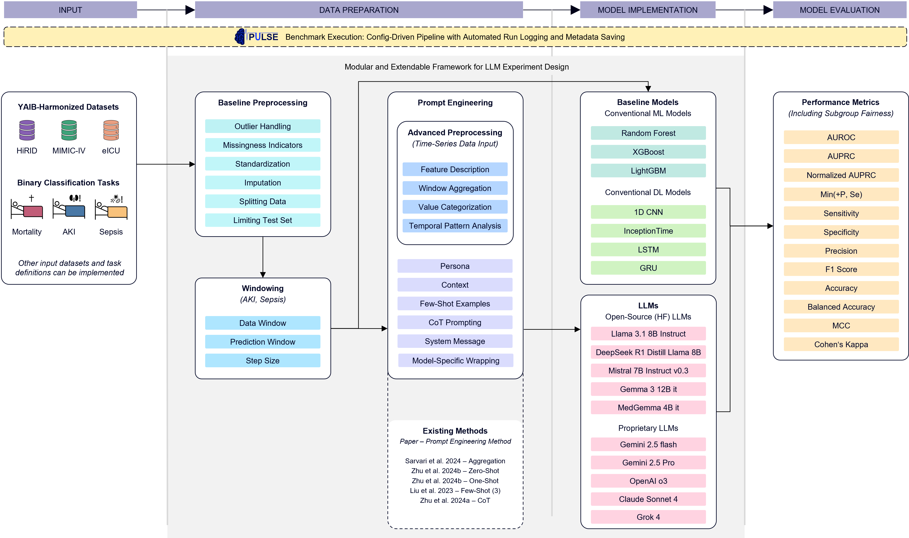

<p align="center">
  
</p>

# PULSE Benchmark

PULSE (_<u>P</u>redictive <u>U</u>nderstanding of <u>L</u>ife-threatening <u>S</u>ituations using <u>E</u>mbeddings_) benchmarks the predictive capabilities of Large Language Models (LLMs) using ICU time-series data.

Results are hosted at <<Anonymized>>

## Overview

This repository contains the implementation for predicting mortality, acute kidney injury (AKI) and sepsis in intensive care unit (ICU) patients using Large Language Models (LLMs). Conventional machine learning and deep learning models serve as baseline comparisons to previously published LLM prompting and fine-tuning methods. Data preparation and model implementation is set up in a highly configurable manner to allow for flexible experimental design.



## Getting started

### Installation

1. Clone the repository:

   ```bash
   git clone https://github.com/anonymous/pulse-benchmark.git
   cd pulse
   ```

2. Install dependencies:

   ```bash
   pip install -r requirements.txt
   ```

3. Adjust configs/config_benchmark.yaml

   Default config

   - app_mode: "benchmark"
   - tasks: choose tasks to perform benchmark on
   - dataset: choose datasets to perform benchmark on
   - standardize: true for convDL, fals for convML and LLMs
   - windowing: enabled and window size 6
   - prompting_ids: choose prompting approach to perform benchark on and set number of shots to perform few-shot prompting.
   - Load_models: choose models to perform benchmark on. Make sure that standardization method matches the model

   Model specific configs can be adjusted if needed. For propriatary LLMs make sure that the api key name matches to the name set as an environment variable in secrets/.env folder. This will be loaded automatically. For convDL models, the architecture is set in the config.

## Data

**Harmonized Data**

The harmonized datasets are available on the BMDS Lab's NAS. The credentialling process at Physionet for HiRID, MIMIC-IV and eICU must be completet before working with this data.

**Datasets:**

- HiRID (Switzerland, single site)
- MIMIC-IV (US, single-site)
- eICU (US, multi-site)

**Harmonization:**

Variable mapping, artifact removal, unit harmonization, cohort and variable selection was conducted according to the YAIB workflow (https://github.com/rvandewater/YAIB). Resulting cohorts vary between tasks with overlapping stay_ids within a dataset.

## Tasks

Task Definitions are in accordance with YAIB (https://arxiv.org/abs/2306.05109).

1. **Mortality**

   - **Task Description**: Binary classification, one prediction per stay, patient status at the end of the hospital stay predicted at 25h after ICU admission
   - **Data Structure**: Hourly data of first 25h of ICU stay for cases and controls, one label per stay_id

2. **Acute Kidney Injury (AKI)**

   - **Task Description**: Binary classification, multiple predictions per stay possible and dependent on data/prediction window setup
   - **Data Structure**: Hourly data and hourly labels, whole ICU stay duration for controls, until 12h after defined AKI onset for cases

3. **Sepsis**
   - **Task Description**: Binary classification, multiple predictions per stay possible and dependent on data/prediction window setup
   - **Data Structure**: Hourly data and hourly labels, whole ICU stay duration for controls, until 12h after defined sepsis onset for cases

## Implemented Models

| Type                | Models                                                                                                      |
| ------------------- | ----------------------------------------------------------------------------------------------------------- |
| **conventional ML** | RandomForest, XGBoost, LightGBM                                                                             |
| **conventional DL** | CNN, LSTM, GRU, InceptionTime                                                                               |
| **LLM**             | Llama 3.1-8b-Instruct, DeepseekR1Llama8b, Mistral-7b, GPT4o, Gemini2p5 flash and pro, ClaudeSonnet4, Grok 4 |

## Results

Check https://j4nberner.github.io/pulse/ for Benchmark Results.

Each benchmark run creates an output folder with a timestamp.
A Metric Tracker is running alongside each training / evaluation process. Predictions are tracked and evaluated of all validation and test runs and saved to a json file in the output. Metadata with prompt infos and demographic distribution is saved as csv to output folder.

## Train a model

1. adjust config_benchmark.yaml
   - make sure that in the model-specific config, mode is set to "train"
   - choose tasks & datasets to train and evaluate
   - choose models to train
2. run PULSE_benchmark.py

-> models are evaluated automatically

## Evaluate a model (without training)

1. adjust config_benchmark.yaml
   - make sure that in the model-specific config, mode is set to "inference"
   - choose tasks & datasets to train and evaluate
   - choose models to train
2. run PULSE_benchmark.py

## Add a new model

1. Add a new ExampleModel.yaml to model_configs/ with its config

   ```json
   - name: "ExampleModel"
      params:
         trainer_name: "ExampleTrainer"
         type: "convML"
         mode: "train"
         output_shape: 1
         ...
   ```

2. List the model name in config_train.yaml under models

3. Add a new file in src/models which will host the model and optionally the trainer class

   ```python
   class ExampleModel(PulseModel):
      def __init__(self, params: Dict[str, Any], **kwargs) -> None:
         super().__init__(model_name, params, trainer_name, **kwargs)
   ```

   ```python
   class ExampleTrainer():
      def __init__(self, model, train_loader, val_loader):
         self.model = model
         self.train_loader = train_loader
         self.test_loader = test_loader


      def train(self):
         # training loop
         pass
   ```

4. add the new model and optional trainer and import to the src/models/\_\_init\_\_.py

## Inference with proprietary LLMs

Proprietary LLMs request an endpoint URI and api key to work. They are searched for by name in the environment variables. When working locally, place a .env file in the root/secrets folder with URI's and keys. Check the model config file to get the correct names.
